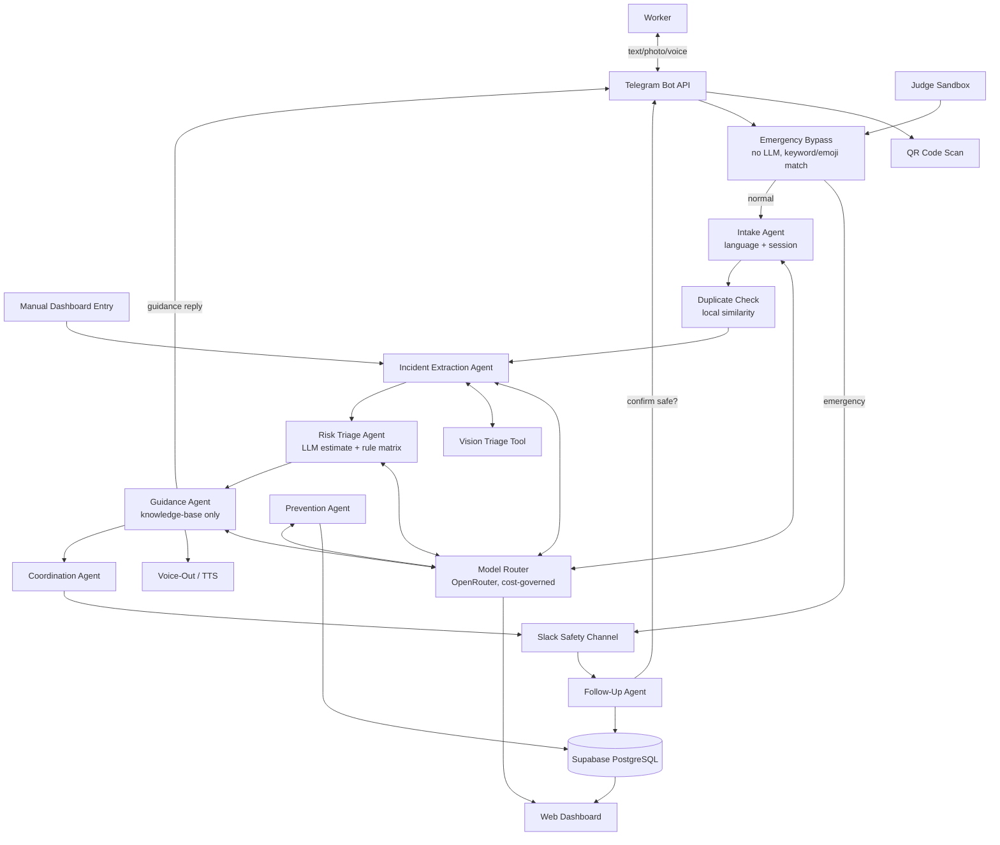

# SentinelLoop AI — AI Powered Multilingual Workplace Hazard Prevention Agentic Platform

[](https://www.python.org/)
[](https://kernel.yaala.ai)
[-orange.svg)](https://openrouter.ai)
[](https://supabase.com)
[](https://core.telegram.org/bots)
[](https://api.slack.com)
[](#)
[](LICENSE)

## 🔗 Live Links

> **⚠️ Fill these in before submission — do not leave placeholders in the final README.**

| | Link |
|---|---|
| 🌐 **Landing page** | `https://<your-deployment-url>.example.com` |
| 📊 **Live dashboard** | `https://<your-deployment-url>.example.com/dashboard` |
| 🤖 **Telegram bot** | `https://t.me/<YourBotUsername>` |
| 🧪 **Try it live (sandbox, no Telegram needed)** | `https://<your-deployment-url>.example.com/sandbox` |
| 🎥 **Demo video (5 min)** | `<your video link — YouTube/Drive, must be publicly viewable>` |
| 💻 **Forked repository** | `https://github.com/<your-username>/agent-kernel` |

---

## 1. SentinelLoop AI

**SentinelLoop AI** is a multilingual, multi-agent workplace safety platform built on **Yaala Labs Agent Kernel** for the IDEALIZE 2026 Agent Kernel mini-competition. It closes the gap between a worker *noticing* danger and an organization *acting* on it, connecting three stakeholders:

* 👷 **Workers** — factory floor staff, lab technicians, maintenance crews — reporting hazards from their own phone, in their own language, via **Telegram** (text, photo, or voice), or by scanning a **QR code** at the hazard location.
* 🦺 **Safety Officers & Maintenance Teams** — receiving structured, risk-ranked alerts and managing response through **Slack**, or logging a phoned-in report directly via the dashboard's **manual entry** form.
* 📊 **Management** — reviewing recurring-hazard predictions, response-time analytics, and exportable audit trails through a **web dashboard**.
* 🧑‍⚖️ **Judges / Evaluators** — can test the entire pipeline instantly through the **live sandbox**, with no Telegram account or setup required.

### Why an Agentic System?

Hazard reporting is a language, trust, and follow-through problem as much as a technical one. A worker who spots a frayed wire mid-shift won't fill out an English safety form — but they will send a two-second voice note or a photo if the channel is as easy as texting a friend. A rigid form also can't decide, on its own, whether "oil near the packing machine" is a low-priority cleanup or an active slip hazard requiring immediate escalation. SentinelLoop's agent pipeline handles that judgment; a **deterministic rule matrix**, not the LLM, makes the final risk call, and a worker confirmation step closes the loop so nothing is marked "resolved" on an officer's word alone. For a true emergency, a **deterministic keyword bypass** skips the AI entirely — the system never makes a worker wait on a model response to get help.

---

## 2. Problem Statement

Workplaces regularly have warning signs before an accident — exposed wiring, chemical spills, damaged machinery, blocked exits — that go unreported or unresolved because:

1. **Language barriers** — workers are often more fluent in Sinhala or Tamil than in the English typically required by formal safety forms.
2. **Reporting friction** — paper forms, long web forms, or "tell your supervisor" processes are too slow for something noticed in passing.
3. **Near-misses get ignored** — an event that *could* have caused injury but didn't often isn't recorded at all, so the same hazard recurs.
4. **No clear ownership** — a report dropped into a group chat or told to a supervisor verbally has no assigned owner, no deadline, and no follow-up.
5. **Fear of blame** — workers may avoid reporting to sidestep being blamed for the hazard or creating trouble.
6. **Data goes nowhere** — even recorded incidents rarely get analyzed for patterns (the same machine failing repeatedly, the same location generating spills).

SentinelLoop AI is built directly against these six failure points.

---

## 3. Solution Overview

```text
                    Worker (Text / Photo / Voice, Sinhala · Tamil · English)
                              │
                    ┌─────────┴─────────┐
                    ▼                   ▼
            Telegram Bot API      QR Code Scan
            (or Sandbox / Manual Dashboard Entry — same pipeline, different door)
                              │
                              ▼
        Deterministic Emergency Bypass ── SOS/🆘 detected? ──▶ Instant Critical alert
                              │                                  (zero LLM calls, <100ms)
                    (no match, continue)
                              ▼
        Intake Agent  (language detection · translation · session continuity)
                              ▼
        Duplicate/Recurring-Hazard Check  (local similarity, LLM only as rare tiebreaker)
                              ▼
        Incident Extraction Agent  (structured fields · one clarification question if needed)
                              ▼
        Risk Triage Agent  (LLM estimates severity/likelihood → deterministic matrix decides level)
                              ▼
        Guidance Agent  (approved instructions only · optional voice-out reply)
                              ▼
        Coordination Agent ──▶ Slack Alert ──▶ Officer Accepts / Reassigns / Escalates
                              ▼
        Follow-Up Agent ──▶ Evidence upload ──▶ Worker Confirms Safe ──▶ Incident Closed
                              ▼
        Prevention Agent  (recurring-pattern detection → preventive-inspection recommendation)
                              ▼
        Dashboard: Loop ring · risk-tagged cards · predictions · audit export · router status
```

Every LLM call in this pipeline is routed through a single **cost-governed OpenRouter model router** rather than agents calling providers directly — see [§8](#8-model-router--cost-governance).

---

## 4. Why Agent Kernel?

> **SentinelLoop AI is an Agent Kernel use case where a coordinated set of agents manages a real-world accountability workflow — hazard report to verified resolution — through tools, session state, external integrations, and a persistent database, not a single chatbot loop.**

* **Multi-agent orchestration** — eight focused agents, each with one job, rather than one agent trying to do everything.
* **Session & memory** — each worker's Telegram `chat_id` (or sandbox `session_id`) maps to a persistent session, so a clarification reply or a "still not fixed" follow-up correctly continues the *same* incident draft.
* **Guardrail hooks** — enforce that guidance never goes beyond the approved knowledge base, that High/Critical incidents require human confirmation before auto-closing, and that anonymous reports never leak identity into analytics.
* **External integrations** — Telegram and Slack as the two live, demoable integration points.
* **Tool-bound reasoning** — the risk agent *estimates* via LLM but never *decides* via LLM; `calculate_risk()` is a deterministic tool the agent must call.
* **Deliberate non-AI paths** — the emergency bypass and the risk matrix itself are proof the team knows not everything belongs behind an LLM call.

---

## 5. Agent Architecture



---

## 6. Core Agents & Tools

| Agent / Tool | Responsibility | Model Router Role |
|---|---|---|
| `intake_agent` | Language detection, translation, session continuity, QR-tag parsing | `role_fast` |
| `incident_agent` | Extracts structured hazard fields, asks for what's missing | `role_fast` |
| `risk_agent` | Estimates severity/likelihood; **deterministic matrix** makes the final call | `role_reasoning` |
| `guidance_agent` | Selects/rephrases pre-approved safety instructions only | `role_guidance` |
| `coordination_agent` | Routes incident to the correct team in Slack | — (no LLM) |
| `followup_agent` | Tracks resolution, requests worker confirmation before closing | — (no LLM) |
| `prevention_agent` | Detects recurring hazard patterns, recommends inspection | `role_reasoning` |
| `vision_tools` | Suggests hazard category from a photo when text is sparse | `role_vision` |
| `voice_tools` | Transcribes worker voice notes (speech-in) | OpenRouter audio endpoint |
| `voice_out_tools` | Synthesizes guidance replies as voice notes (speech-out) | `role_tts` |
| `duplicate_tools` | Merges repeat reports of the same hazard, zero-cost first pass | `role_fast` (rare tiebreaker only) |
| `emergency_bypass` | Deterministic keyword/emoji emergency detection | — (no LLM, <100ms) |
| `model_router` | Central, cost-governed LLM/vision/audio access for every agent | — (infrastructure) |

---

## 7. Data Model

Core Supabase tables: `incidents` (including `duplicate_count`, `input_channel`, `is_anonymous`), `incident_evidence`, `risk_assessments`, `assignments`, `incident_updates`, `handover_summaries`. Row Level Security is enabled on all tables; access is server-side only via the `service_role` key.

### Risk Matrix

| Score (Severity × Likelihood) | Level |
|---|---|
| 1–4 | Low |
| 5–9 | Medium |
| 10–16 | High |
| 17–25 | Critical |

Forced overrides: **minimum High** if `already_injured`; **minimum Critical** if an electrical/fire/chemical hazard is currently `active`; **one level higher** if `people_exposed ≥ 5`. Every classification returns a plain-language `explanation`.

---

## 8. Model Router & Cost Governance

Every AI call — chat, vision, transcription, and text-to-speech — routes through `tools/model_router.py`:

1. Queries OpenRouter's live model list at runtime and selects the best currently-free model per role (chat/vision/TTS), since the free-tier roster rotates weekly and is resolved live rather than hardcoded.
2. Falls back to a cheap **paid** model only when the free pick is rate-limited or unavailable.
3. Tracks cumulative spend in `spend_ledger.json` against `OPENROUTER_BUDGET_CEILING_USD` — including audio transcription and TTS cost, not just chat — and refuses paid calls past that ceiling so a demo never hard-fails on cost.
4. Surfaces which model served the last few requests, and live spend, on the dashboard (`GET /router/status`).

---

## 9. Design System

| Token | Hex | Use |
|---|---|---|
| `--ink` | `#1F1114` | Primary background — oxblood-tinted near-black |
| `--panel` | `#2E1A1D` | Card / surface |
| `--panel-raised` | `#3A2226` | Hover / active state |
| `--chalk` | `#F4EBE8` | Primary text on dark |
| `--muted` | `#B99A96` | Secondary text |
| `--maroon` | `#7C1F2E` | **Brand color** — buttons, nav, links |
| `--maroon-deep` | `#5C1620` | Pressed/darker brand state |
| `--verified-teal` | `#3FA796` | Low risk / resolved |
| `--signal-amber` | `#E0A83D` | Medium risk |
| `--ember-orange` | `#C9642E` | High risk |
| `--hazard-red` | `#E63946` | Critical risk **only** — deliberately brighter/louder than the muted brand maroon |

Typography: `Space Grotesk` (headers/KPIs), `IBM Plex Sans` (UI text), `IBM Plex Mono` (incident IDs, timestamps, risk scores). Signature element: a radial "Loop" ring (Report → Understand → Assess → Alert → Act → Verify → Learn) on the dashboard and landing page hero.

---

## 10. Distinguishing Features

* 🔲 **QR-code instant-context reporting** — scan at a machine, Telegram opens pre-tagged with location/equipment.
* 🔁 **Zero-cost duplicate/recurring merge** — local similarity first, LLM only as a rare tiebreaker; auto-escalates priority when multiple workers report the same hazard.
* 📄 **Explainable audit-trail export** — one click, the full decision trail from raw report to resolution.
* 🆘 **Deterministic emergency bypass** — "SOS"/🆘 triggers an instant Critical alert with **zero LLM calls**.
* 📈 **Predictive hazard forecasting** — recurring patterns surface as "recommend inspection before next shift."
* 🖼️ **Vision-based triage** — a hazard photo with little/no caption still gets a category suggestion.
* 🎙️ **Full voice loop** — voice notes in, and voice guidance replies out, in the worker's own language.
* 🗒️ **Automated shift handover briefings** — auto-generated open-incident summary posted to Slack at shift change.
* 🖥️ **Manual dashboard entry** — officers can log a phoned-in or in-person report directly, running through the identical risk pipeline as any Telegram report — no shortcut, no separate rules.
* 🧪 **Live judge sandbox** — anyone can test the full pipeline from the dashboard with zero setup, no Telegram account required.

---

## 11. Tech Stack

| Layer | Technology |
|---|---|
| Agent runtime | Agent Kernel (`ak-py`) |
| Language | Python 3.12, `uv` |
| LLM / vision / audio access | OpenRouter, cost-governed auto-routing |
| Worker channel | Telegram Bot API (`python-telegram-bot`) |
| Officer channel | Slack (Agent Kernel's Slack integration) |
| Database | Supabase PostgreSQL |
| File storage | Supabase Storage (`evidence` bucket) |
| Backend API | FastAPI |
| Dashboard & landing frontend | Styled with the maroon design tokens above |
| Testing | pytest, mocked external calls |

---

## 12. Setup Instructions

### Prerequisites
Python 3.12+, [uv](https://github.com/astral-sh/uv), Git, Make, a Supabase account, an OpenRouter account, a Telegram bot token from [@BotFather](https://t.me/BotFather), and Slack app credentials for a test workspace.

### 12.1 Clone and install
```bash
git clone https://github.com/<your-username>/agent-kernel.git
cd agent-kernel/ak-py && ./build.sh
```

### 12.2 Supabase
Create a project at [supabase.com](https://supabase.com), copy the URL and `service_role` key, create a private `evidence` storage bucket, and run `database/schema.sql` in the SQL Editor.

### 12.3 OpenRouter
Create an account and API key at [openrouter.ai](https://openrouter.ai). Add credits for paid-model fallback beyond the free tier.

### 12.4 Telegram
Message [@BotFather](https://t.me/BotFather), `/newbot`, save the token — no webhook or public URL needed for local development.

### 12.5 Environment
```bash
cd use-cases/sentinelloop_ai
cp .env.example .env
```
```
TELEGRAM_BOT_TOKEN=...
SLACK_BOT_TOKEN=...
OPENROUTER_API_KEY=...
OPENROUTER_BUDGET_CEILING_USD=2.50
SUPABASE_URL=https://xxxx.supabase.co
SUPABASE_SERVICE_ROLE_KEY=...
SUPABASE_STORAGE_BUCKET=evidence
```
```bash
uv sync
```

---

## 13. How to Run

```bash
# Start the service (Telegram/Slack listeners + dashboard API)
uv run python -m sentinelloop_ai.main

# Seed a realistic demo scenario
uv run python scripts/seed_demo_data.py

# Quick end-to-end check without live credentials
uv run python scripts/smoke_test.py

# View the dashboard
open http://localhost:8000/dashboard
```

Fastest way to evaluate without any setup: use the **live sandbox** link at the top of this README, or message the live Telegram bot directly.

---

## 14. Testing

```bash
cd ak-py
uv run pytest use-cases/sentinelloop_ai/tests/
```

All external calls (Telegram, Slack, OpenRouter, Supabase) are mocked, so the suite runs fully offline. Formatting: `make lint-check-all` / `make lint-all`.

---

## 15. UN Sustainable Development Goals Alignment

| SDG | How SentinelLoop Contributes |
|---|---|
| 🏥 **SDG 3** — Good Health & Well-Being | Prevents workplace injuries by surfacing hazards before they cause harm |
| 💼 **SDG 8** — Decent Work & Economic Growth | Builds safer, more accountable workplace conditions |
| 🏗️ **SDG 9** — Industry, Innovation & Infrastructure | Applies agentic AI to real industrial safety operations |
| ⚖️ **SDG 10** — Reduced Inequalities | Multilingual, full voice-loop reporting removes literacy/language barriers to safety access |
| 🏛️ **SDG 16** — Peace, Justice & Strong Institutions | Anonymous reporting, audit trails, and accountable case ownership |

---

## 16. Repository Structure

```text
use-cases/sentinelloop_ai/
├── agents/
│   ├── intake_agent.py
│   ├── incident_agent.py
│   ├── risk_agent.py
│   ├── guidance_agent.py
│   ├── coordination_agent.py
│   ├── followup_agent.py
│   ├── prevention_agent.py
│   └── handover_agent.py
├── tools/
│   ├── risk_tools.py
│   ├── model_router.py
│   ├── duplicate_tools.py
│   ├── forecast_tools.py
│   ├── vision_tools.py
│   ├── voice_tools.py
│   └── voice_out_tools.py
├── integrations/
│   ├── telegram_handler.py
│   └── slack_handler.py
├── guardrails/
│   ├── input_validation.py
│   ├── output_validation.py
│   └── emergency_bypass.py
├── knowledge_base/
│   ├── electrical_safety.md
│   ├── fire_safety.md
│   ├── chemical_safety.md
│   └── general_hazards.md
├── database/
│   ├── models.py
│   ├── schemas.py
│   ├── repository.py
│   ├── client.py
│   ├── schema.sql
│   └── migrations/
├── dashboard/
│   ├── api.py
│   └── frontend/
│       ├── landing/
│       ├── report/          # manual entry
│       ├── sandbox/         # live judge sandbox
│       ├── incident/[id]/
│       └── components/Shell/
├── scripts/
│   ├── seed_demo_data.py
│   ├── generate_location_qr.py
│   └── smoke_test.py
├── assets/qr/
├── tests/
├── .env.example
├── config.yaml
├── README.md
├── AGENTS.md
└── SPEC.md
```

---

## 17. Team & Credits

* **Project**: SentinelLoop AI
* **Competition**: IDEALIZE 2026 / Yaala Labs Agent Kernel Mini-Competition
* **Core Framework**: [Yaala Labs Agent Kernel](https://kernel.yaala.ai)
* **Team Lead**: Mister — Founder & CEO, Zatroz
* **Team**: Abdul Basith, Abdul Rahman, Prabhath Nishantha, Yuvarajah Divejikan
* **License**: MIT

---

*Replace every placeholder link in §"Live Links" and the "Status" badge with real values before final submission — an unfilled placeholder or a fabricated number is worse than an honestly-labeled "in development" state.*
