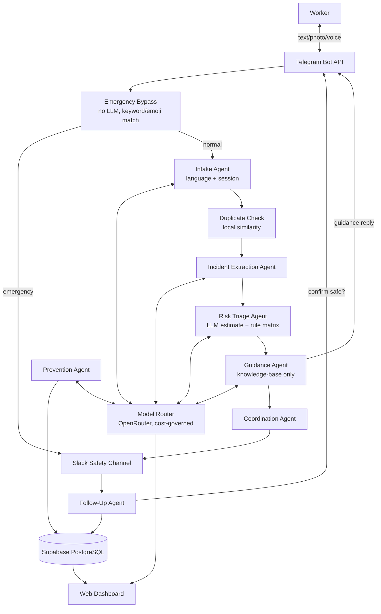

# SentinelLoop AI — Multilingual Workplace Hazard Prevention Agent

[](https://www.python.org/)
[](https://kernel.yaala.ai)
[-orange.svg)](https://openrouter.ai)
[](https://supabase.com)
[](https://core.telegram.org/bots)
[](https://api.slack.com)
[](#)
[](LICENSE)

> **Worker-facing bot**: `@SentinelLoopReportBot` on Telegram *(update once deployed)*
> **Dashboard**: `http://localhost:8000/dashboard` locally, or your deployed URL *(update once deployed)*
> **API Docs**: `/docs` on your running instance
> **Slack safety channel**: configured per-organization at setup

---

## 1. SentinelLoop AI

**SentinelLoop AI** is a multilingual, multi-agent workplace safety platform built on **Yaala Labs Agent Kernel**, designed for the IDEALIZE 2026 Agent Kernel mini-competition. It closes the gap between a worker *noticing* danger and an organization *acting* on it, connecting three stakeholders:

* 👷 **Workers** — factory floor staff, lab technicians, maintenance crews — reporting hazards from their own phone, in their own language, via **Telegram**.
* 🦺 **Safety Officers & Maintenance Teams** — receiving structured, risk-ranked alerts and managing response through **Slack**.
* 📊 **Management** — reviewing recurring-hazard patterns, response-time analytics, and exportable audit trails through a **web dashboard**.

### Why an Agentic System?

Hazard reporting is a language, trust, and follow-through problem as much as a technical one. A worker who spots a frayed wire mid-shift won't fill out an English safety form — but they will send a two-second voice note or a photo if the channel is as easy as texting a friend. A rigid form also can't decide, on its own, whether "oil near the packing machine" is a low-priority cleanup or an active slip hazard requiring immediate escalation — that needs reasoning over context (is it active? how many people are exposed? has this location failed before?). SentinelLoop's agent pipeline handles the understanding and the judgment; a **deterministic rule matrix**, not the LLM, makes the final risk call, and a worker confirmation step closes the loop so nothing is marked "resolved" on an officer's word alone.

---

## 2. Problem Statement

Workplaces regularly have warning signs before an accident — exposed wiring, chemical spills, damaged machinery, blocked exits — that go unreported or unresolved because:

1. **Language barriers** — workers are often more fluent in Sinhala or Tamil than in the English typically required by formal safety forms.
2. **Reporting friction** — paper forms, long web forms, or "tell your supervisor" processes are too slow for something noticed in passing.
3. **Near-misses get ignored** — an event that *could* have caused injury but didn't often isn't recorded at all, so the same hazard recurs.
4. **No clear ownership** — a report dropped into a group chat or told to a supervisor verbally has no assigned owner, no deadline, and no follow-up.
5. **Fear of blame** — workers may avoid reporting to sidestep being blamed for the hazard or creating trouble.
6. **Data goes nowhere** — even recorded incidents rarely get analyzed for patterns (the same machine failing repeatedly, the same location generating spills).

SentinelLoop AI is built directly against these six failure points.

---

## 3. Solution Overview

```text
Worker
  │ (Text / Photo / Voice note, Sinhala · Tamil · English)
  ▼
Telegram Bot API
  ▼
Deterministic Emergency Bypass  ──── SOS/🆘 detected? ──▶ Instant Critical alert
  │ (no match, continue)             (zero LLM calls, <100ms)
  ▼
Intake Agent  (language detection · translation · session continuity)
  ▼
Duplicate/Recurring-Hazard Check  (local similarity, LLM only as rare tiebreaker)
  ▼
Incident Extraction Agent  (structured fields · one clarification question if needed)
  ▼
Risk Triage Agent  (LLM estimates severity/likelihood → deterministic matrix decides level)
  ▼
Guidance Agent  (retrieves pre-approved safety instructions, never invents new ones)
  ▼
Coordination Agent  ──▶ Slack Alert  ──▶ Officer Accepts / Reassigns / Escalates
  ▼
Follow-Up Agent  ──▶ Evidence upload ──▶ Worker Confirms Safe ──▶ Incident Closed
  ▼
Prevention Agent  (recurring-pattern detection → preventive-inspection recommendation)
  ▼
Dashboard: Loop status ring · risk-tagged incident cards · predictions · audit export
```

Every LLM call in this pipeline is routed through a single **cost-governed OpenRouter model router** rather than agents calling providers directly — see [§8](#8-model-router--cost-governance).

---

## 4. Why Agent Kernel?

> **SentinelLoop AI is an Agent Kernel use case where a coordinated set of agents manages a real-world accountability workflow — hazard report to verified resolution — through tools, session state, external integrations, and a persistent database, not a single chatbot loop.**

* **Multi-agent orchestration** — seven focused agents (intake, extraction, risk, guidance, coordination, follow-up, prevention), each with one job, rather than one agent trying to do everything.
* **Session & memory** — each worker's Telegram `chat_id` maps to a persistent session, so a clarification reply or a "still not fixed" follow-up correctly continues the *same* incident draft instead of starting a new one.
* **Guardrail hooks** — enforce that guidance never goes beyond the approved knowledge base, that High/Critical incidents require human confirmation before auto-closing, and that anonymous reports never leak identity into analytics.
* **External integrations** — Telegram (worker channel) and Slack (officer channel) as the two live, demoable integration points.
* **Tool-bound reasoning** — the risk agent *estimates* via LLM but never *decides* via LLM; `calculate_risk()` is a deterministic tool the agent must call, keeping the AI advisory rather than authoritative on safety-critical decisions.

---

## 5. Agent Architecture



---

## 6. Core Agents

| Agent | Responsibility | Model Router Role |
|---|---|---|
| `intake_agent` | Language detection, translation, session continuity, QR-tag parsing | `role_fast` |
| `incident_agent` | Extracts structured hazard fields, asks for what's missing | `role_fast` |
| `risk_agent` | Estimates severity/likelihood; **deterministic matrix** makes the final call | `role_reasoning` |
| `guidance_agent` | Selects/rephrases pre-approved safety instructions only | `role_guidance` |
| `coordination_agent` | Routes incident to the correct team in Slack | — (no LLM) |
| `followup_agent` | Tracks resolution, requests worker confirmation before closing | — (no LLM) |
| `prevention_agent` | Detects recurring hazard patterns, recommends inspection | `role_reasoning` |
| `handover_agent` | Shift briefing from live incident facts; **one** `role_fast` phrasing call | `role_fast` |
| `vision_tools` *(bonus)* | Suggests hazard category from a photo when text is sparse | `role_vision` |

---

## 7. Data Model

Five core Supabase tables (see `database/schema.sql`): `incidents`, `incident_evidence`, `risk_assessments`, `assignments`, `incident_updates` — plus `handover_summaries` if the shift-handover feature is included. Row Level Security is enabled on all tables; access is server-side only via the `service_role` key.

### Risk Matrix

| Score (Severity × Likelihood) | Level |
|---|---|
| 1–4 | Low |
| 5–9 | Medium |
| 10–16 | High |
| 17–25 | Critical |

Forced overrides: **minimum High** if `already_injured`; **minimum Critical** if an electrical/fire/chemical hazard is currently `active`; **one level higher** if `people_exposed ≥ 5`. Every classification returns a plain-language `explanation` — the matrix decides, the LLM only estimates the inputs.

---

## 8. Model Router & Cost Governance

Rather than hardcoding a single LLM provider, SentinelLoop routes every call through `tools/model_router.py`:

1. Queries OpenRouter's live model list at runtime and selects the best currently-free model, preferring **Qwen → Gemini → DeepSeek → any other free model** (the free-tier roster rotates weekly, so this is resolved live rather than assumed).
2. Falls back to a cheap **paid** model only when the free pick is rate-limited or unavailable.
3. Tracks cumulative spend in `spend_ledger.json` against a configured `OPENROUTER_BUDGET_CEILING_USD` and refuses paid calls past that ceiling — a demo never hard-fails on cost.
4. Surfaces which model served the last few requests, and live spend, on the dashboard (`GET /router/status`).

---

## 9. Design System

| Token | Hex | Use |
|---|---|---|
| `--ink` | `#1C2024` | Primary background |
| `--panel` | `#262B31` | Card / surface |
| `--chalk` | `#F2F0EA` | Text on dark |
| `--signal-amber` | `#E8A33D` | Medium risk |
| `--ember-orange` | `#C9642E` | High risk |
| `--hazard-red` | `#D64545` | Critical risk **only** |
| `--verified-teal` | `#3FA796` | Low risk / resolved |

Typography: `Space Grotesk` (headers/KPIs), `IBM Plex Sans` (UI text), `IBM Plex Mono` (incident IDs, timestamps, risk scores). Saturated color appears **only** to indicate risk or resolution state. Signature element: a radial "Loop" ring (Report → Understand → Assess → Alert → Act → Verify → Learn) on the dashboard home screen.

---

## 10. Distinguishing Features

* 🔲 **QR-code instant-context reporting** — scan a QR at a machine, Telegram opens pre-tagged with location/equipment; the worker only describes the hazard.
* 🔁 **Zero-cost duplicate/recurring merge** — local text-similarity first, LLM only as a rare tiebreaker; five reports of the same spill collapse into one incident with auto-escalated priority.
* 📄 **Explainable audit-trail export** — one click, the full decision trail from raw report to resolution, in a format a safety inspector could actually use.
* 🆘 **Deterministic emergency bypass** — "SOS"/🆘 in any supported language triggers an instant, hardcoded Critical alert with **zero LLM calls** in the critical path.
* 📈 **Predictive hazard forecasting** — recurring category+location patterns surface as "recommend inspection before next shift," turning the system reactive → preventive.
* 🖼️ **Vision-based triage** — a hazard photo with little/no caption still gets a category suggestion via a vision-capable model.
* 🎙️ **Voice message reporting** — WhatsApp and Telegram voice notes transcribed via OpenRouter's unified audio endpoint, in the worker's own language, with spend tracked against the same OpenRouter budget ceiling as text and vision.
* 🗒️ **Automated shift handover briefings** — `handover_agent` collects open/critical/review/overdue incidents, calls `role_fast` **once** to phrase a bullet briefing, stores it in `handover_summaries`, and posts it to the Slack Safety Channel. Judges can trigger **Generate Shift Handover** from the dashboard. Agent Kernel has no in-process cron/scheduler, so automatic shift-end jobs are not wired here.

```
Phase 2:
Automatic shift-end scheduling using Agent Kernel scheduler.
```

Configured shift-end times in `config.yaml`:

```yaml
handover:
  morning_shift_end: "14:00"
  evening_shift_end: "22:00"
  verification_timeout_hours: 24
```

---

## 11. Tech Stack

| Layer | Technology |
|---|---|
| Agent runtime | Agent Kernel (`ak-py`) |
| Language | Python 3.12, `uv` |
| LLM access | OpenRouter (Qwen / Gemini / DeepSeek / free-tier auto-routing) |
| Worker channel | Telegram Bot API (`python-telegram-bot`) |
| Officer channel | Slack (Agent Kernel's Slack integration) |
| Database | Supabase PostgreSQL |
| File storage | Supabase Storage (`evidence` bucket) |
| Backend API | FastAPI |
| Dashboard frontend | HTML/CSS/JS or React, per repo convention, styled with the design tokens above |
| Testing | pytest, mocked external calls |

---

## 12. Setup Instructions

### Prerequisites
Python 3.12+, [uv](https://github.com/astral-sh/uv), Git, Make, a Supabase account, an OpenRouter account, a Telegram bot token from [@BotFather](https://t.me/BotFather), and Slack app credentials for a test workspace.

### 12.1 Clone and install
```bash
git clone https://github.com/<your-username>/agent-kernel.git
cd agent-kernel/ak-py && ./build.sh
```

### 12.2 Supabase
Create a project at [supabase.com](https://supabase.com), copy the URL and `service_role` key, create a private `evidence` storage bucket, and run `database/schema.sql` in the SQL Editor.

### 12.3 OpenRouter
Create an account and API key at [openrouter.ai](https://openrouter.ai). Add credits if you want paid-model fallback beyond the free tier.

### 12.4 Telegram
Message [@BotFather](https://t.me/BotFather), `/newbot`, save the token — no webhook or public URL needed for local development.

### 12.5 Environment
```bash
cd use-cases/sentinelloop_ai
cp .env.example .env
```
```
TELEGRAM_BOT_TOKEN=...
SLACK_BOT_TOKEN=...
OPENROUTER_API_KEY=...
OPENROUTER_BUDGET_CEILING_USD=2.50
SUPABASE_URL=https://xxxx.supabase.co
SUPABASE_SERVICE_ROLE_KEY=...
SUPABASE_STORAGE_BUCKET=evidence
```
```bash
uv sync
```

---

## 13. How to Run

```bash
# Start the service (Telegram/Slack listeners + dashboard API)
uv run python -m sentinelloop_ai.main

# Seed a realistic demo scenario
uv run python scripts/seed_demo_data.py

# View the dashboard
open http://localhost:8000/dashboard
```

Send a live test report by messaging your bot on Telegram, e.g. *"Oil spilled near packing machine number four, workers are walking through it."* You should receive a clarification (if needed) and immediate guidance within seconds, with the incident appearing in Slack and on the dashboard.

---

## 14. Testing

```bash
cd ak-py
uv run pytest use-cases/sentinelloop_ai/tests/
```

All external calls (Telegram, Slack, OpenRouter, Supabase) are mocked, so the suite runs fully offline. Formatting: `make lint-check-all` / `make lint-all` per repo convention.

---

## 15. UN Sustainable Development Goals Alignment

| SDG | How SentinelLoop Contributes |
|---|---|
| 🏥 **SDG 3** — Good Health & Well-Being | Prevents workplace injuries by surfacing hazards before they cause harm |
| 💼 **SDG 8** — Decent Work & Economic Growth | Builds safer, more accountable workplace conditions |
| 🏗️ **SDG 9** — Industry, Innovation & Infrastructure | Applies agentic AI to real industrial safety operations |
| ⚖️ **SDG 10** — Reduced Inequalities | Multilingual, voice-capable reporting removes literacy/language barriers to safety access |
| 🏛️ **SDG 16** — Peace, Justice & Strong Institutions | Anonymous reporting, audit trails, and accountable case ownership |

---

## 16. Repository Structure

```text
use-cases/sentinelloop_ai/
├── agents/
│   ├── intake_agent.py
│   ├── incident_agent.py
│   ├── risk_agent.py
│   ├── guidance_agent.py
│   ├── coordination_agent.py
│   ├── followup_agent.py
│   ├── prevention_agent.py
│   └── handover_agent.py
├── tools/
│   ├── risk_tools.py
│   ├── model_router.py
│   ├── duplicate_tools.py
│   ├── forecast_tools.py
│   ├── vision_tools.py
│   └── voice_tools.py
├── integrations/
│   ├── telegram_handler.py
│   └── slack_handler.py
├── guardrails/
│   ├── input_validation.py
│   ├── output_validation.py
│   └── emergency_bypass.py
├── knowledge_base/
│   ├── electrical_safety.md
│   ├── fire_safety.md
│   ├── chemical_safety.md
│   └── general_hazards.md
├── database/
│   ├── models.py
│   ├── schemas.py
│   ├── repository.py
│   ├── client.py
│   ├── schema.sql
│   └── migrations/
│       └── 002_handover_summaries.sql
├── dashboard/
│   ├── api.py
│   └── frontend/
├── scripts/
│   ├── seed_demo_data.py
│   └── generate_location_qr.py
├── assets/qr/
├── tests/
├── .env.example
├── config.yaml
├── README.md
├── AGENTS.md
└── SPEC.md
```

---

## 17. Team & Credits

* **Project**: SentinelLoop AI
* **Competition**: IDEALIZE 2026 / Yaala Labs Agent Kernel Mini-Competition
* **Core Framework**: [Yaala Labs Agent Kernel](https://kernel.yaala.ai)
* **Team Lead**: Mister — Founder & CEO, Zatroz
* **Team**: Abdul Basith, Abdul Rahman, Prabhath Nishantha, Yuvarajah Divejikan
* **License**: MIT

---

*This README reflects the planned/in-progress architecture. Replace placeholder links, badge values, and the "Status" badge once the project is built and deployed — don't leave fabricated numbers (test counts, live URLs) in a submission; update them to the real figures at submission time.*
